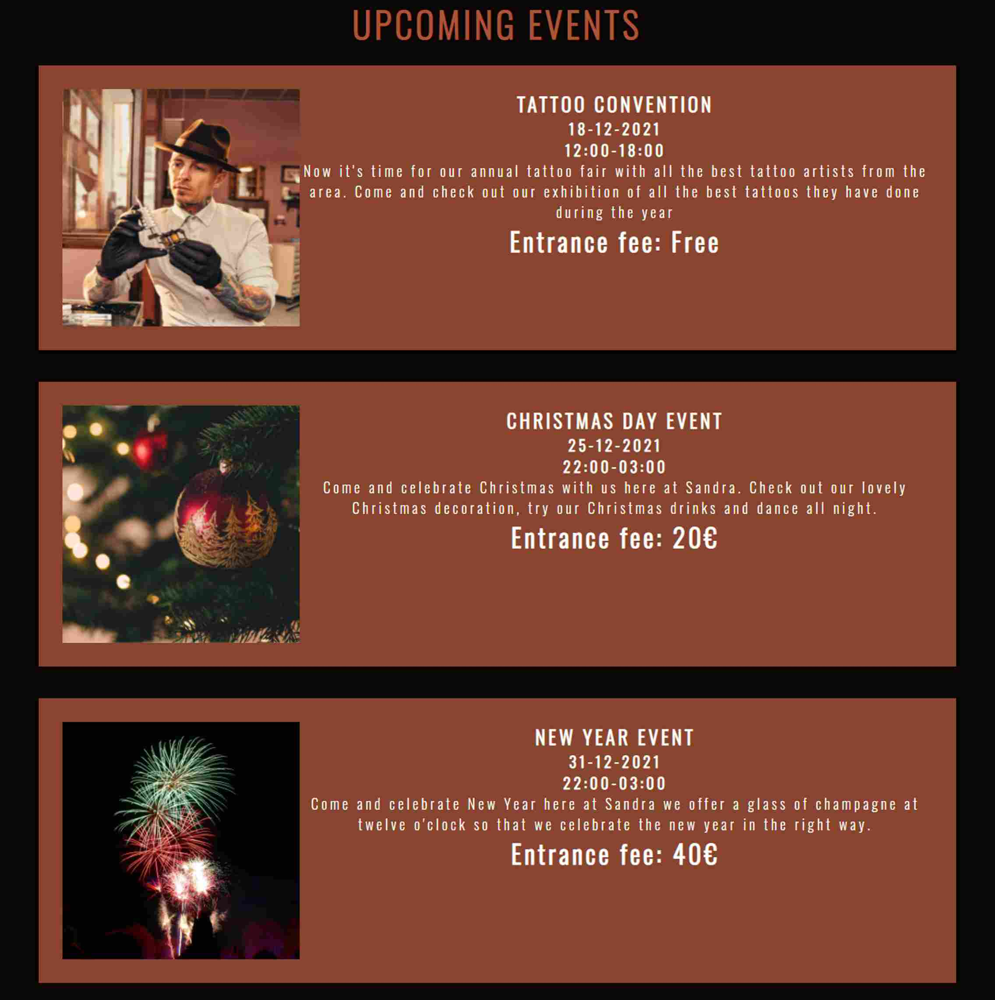

# Sandra
 
The Sandra website is a site for people looking for a nightclub or events in Kalmar. On this site, you can see all the upcoming events planned and relevant information. 

The Sandra site enables users to see what types of events are coming up next what time and date the events have been planned some information about the events and entry price for the events. The Sandra website also has a web form wher you can send a message if you have any questions or if you are interested in booking a venue where you can have your event private or for the public.

## Features 

- __Navigation Bar__

  - Featured at the top of all three pages is the fully responsive navigation bar, navigation bar includes links to the logo/name, Home, Upcoming events, about us, and book Venue page.

  - the navigation bar looks the same on all three pages to make it easy to navigate from different pages without having to go back to the previous page via the back button.

- __landing page image__

  - The landing page contains an image with cover text which includes some words that describe what the website is about.

  - This striking image that set the theme for the site introduces the users to the feel of the website

- __Upcoming events section__

  - The upcoming event section shows the users all the events that are planned in the near future and contains all the relevant information for the event, like times and dates, a description of the event, a descriptive image, and how much the entry fee is.

  - This section will be updated as these events get planned to keep users up to date.

__footer section__

  - The footer section contains the address to the nightclub, contact information, and links to our social media platforms.

  - this section is very important to the users so they can find our location and get in contact with us if they have any other questions.

__About us section__

  - The about us section gives the users some information about what they can expect from Sandra

  - this section also gives some back story about Sandra and the funder of Sandra

__Book venue section__

  - The book venue section is for the users that want to book our venue where they can have their event private or for the public.

  - this section also gives the users who want to send us a message if they have any other questions about the venue.

## Testing

I have tested that all the links work to the various pages regardless of what page you are on.

I have confirmed that the website works and behaves the same in different browsers (Chrome, Safari, Edge)

I have tested that the site looks good and behaves the same on all different screen sizes using dev tools and opened the website on different devices.

I confirmed that the book venue section only accepts the relevant input in the field and that it sends the data by including the (action="https://formdump.codeinstitute.net/") in the form

## Bugs 

Had one bug in the second section in index.html where I could not change the color of element h2 when I used color white or #fff but if I used RGB it worked.

### Validator Testing 

- HTML
  - No errors were returned when passing through the official [W3C validator](https://validator.w3.org/nu/?doc=https%3A%2F%2Fljunkan22.github.io%2Fsandra%2Findex.html)
- CSS
  - No errors were found when passing through the official [(Jigsaw) validator](https://jigsaw.w3.org/css-validator/validator?uri=https%3A%2F%2Fljunkan22.github.io%2Fsandra%2Findex.html&profile=css3svg&usermedium=all&warning=1&vextwarning=&lang=sv)

- Accessibility
  - I have confirmed that the accessibility score is good by running the lighthouse test in dev tools

 ### Unfixed bugs

 no unfixed bugs

 ## Deployment

- The site was deployed to GitHub pages. The steps to deploy are as follows: 
  - Go to the websites repository on GitHub
  - In the GitHub repository navigate to the settings tab
  - In the options, menu go to pages
  - From the source section drop-down menu, select the main then click save
  - (if the page doesn't refresh automatically) Refresh the page and a message will come up with a link to the website

The live link can be found here - https://ljunkan22.github.io/sandra/index.html

## Credits 

- took inspiration and code from love running project.
 
### Media

- The most of images on the website come from [Pexels](https://www.pexels.com/sv-se/)
- The other images are my own
- The images were edited on [Pixlr](https://pixlr.com/se/x/#home) 
- The icons in the footer were taken from [Font Awesome](https://fontawesome.com/)