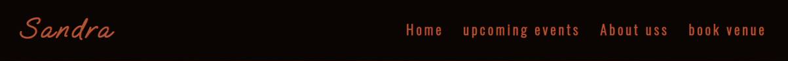
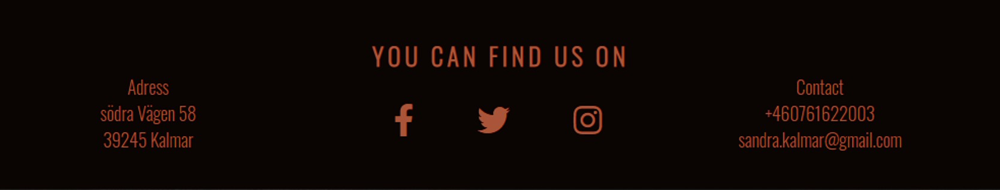

# Sandra
 
The Sandra website is a site for people looking for a nightclub or events in kalmar. On this site you can see all the upcoming events pland and relevent information. 

The Sandra site enable users to see what types of events is coming up next what time and date the events is pland some information about the events and entry price for the events. The sandra website also has a webform wher you can send a message if you have any questions or if you are interested in booking a venue wher you can have your own event private or for the public.

## Features 

- __Navigation Bar__

  - Featured att the top of all three pages is the fully responsive navigation bar, navigation bar includes links to the logo/name, Home, Upcoming events, about us and book Venue page.

  - the navigation bar looks the same on all three pages to make it easy to navigat from difrent pages without having to go back to the previous page via the back button.

- __landing page image__

  - The landing page contains 

  - The landing includes a photograph with text overlay to allow the user to see exactly which location this site would be applicable to. 
  - This section introduces the user to Love Running with an eye catching animation to grab their attention

- __Club Ethos Section__

  - The club ethos section will allow the user to see the benefits of joining the Love Running meetups, as well as the benefits of running overall. 
  - This user will see the value of signing up for the Love Running meetups. This should encourage the user to consider running as their form of exercise. 

